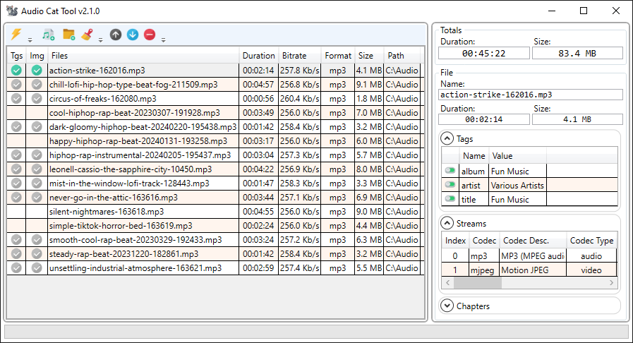

# Audio Cat Tool

**Audio Cat Tool** is a utility for con**cat**enating audio files. It provides a user interface for [FFmpeg](https://ffmpeg.org/) CLI tools (which are required for proper functioning). The tool supports MP3, AAC, Opus, Vorbis, WMA, WAV, and FLAC encodings, which can be packaged in various audio container formats. It normally avoids re-encoding by demuxing and remuxing audio without quality loss; FLAC concatenation is the lossless re-encoding exception described below. Additionally, it preserves media tags and cover images. Tags and chapters can be created and edited, and cover images can be added from image files.

## Screenshot

## Notes

**Metadata tags.** Tag support varies by output container, so FFmpeg may omit tags that the selected format cannot represent.

**Chapters.** AudioCat disables chapter output for Ogg Vorbis, WAV/PCM, and FLAC. CUE sheets are supported as a chapter source for chapter-capable output formats.

**FLAC.** AudioCat re-encodes FLAC audio during concatenation rather than stream-copying it, avoiding timestamp problems observed with FFmpeg's concat workflow. Because FLAC is lossless, this does not reduce audio quality.
