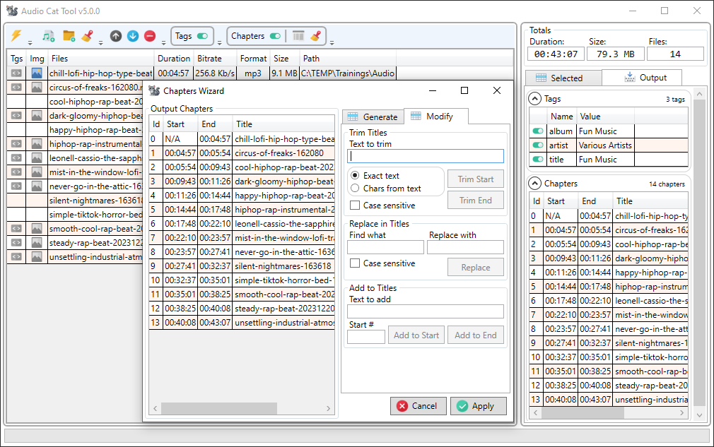

# Audio Cat Tool 

**Audio Cat Tool** is a utility for con**cat**enating audio files. It provides a user interface for [FFMpeg](https://ffmpeg.org/) CLI tools (which are required for proper functioning). The tool supports MP3 and AAC encodings, which can be packaged in various audio container formats. It does not re-encode the audio; instead, it performs demuxing and remuxing, ensuring there is no loss in audio quality. Additionally, it allows for the preservation of media tags and cover images. Tags can be edited, and cover images can be added from image files.

## Screenshot

## Version History

### AudioCat 5.0.0.alpha3
Work in progress, remaking the the chapters generator.
Added a CUE parser and builder, not yet wired it up.

Unable to add CUE in chapters editor. Because the track index does not indicate duration of a track, which results in that we cannot establish the duration of the last track without probing the file to know the duration of the file. The cue files need to be added using the files adding option.

Backlog.
Add full support for opus.
Redo the gray icons.
Need overlapping chapters detection.
When cleaning output chapters activate the output tab.
Automate FFMpeg download if it is not found.
'These files already added', add 'Add anyway' option.

#### Notes.
**Tags support.** The supported tags are specific to a particular file format. As a result, if you set a tag and the output format doesn't support it, it may be missing in the output file. 
**Chapters support.** Some of the formats, like OGG, WAV and FLAC, does not support chapters. The cue sheets is in the implementation backlog, but the cue sheets format is a bit of a hot mess, a lot of testing needs to be done to make sure that the resulting files are understood by all (or most) audio players. 
**FLAC format.** The FFmpeg concatenation of FLAC files is buggy; it copies the audio streams without adjusting the DTS timestamps, so the resulting file will always have a *"non-monotonically increasing DTS"* issue. As a workaround, instead of using 'concat', the app performs a FLAC-to-FLAC re-encoding. Since FLAC is a lossless codec, this still complies with the app's 'no re-encoding' goal.

Previous versions

### AudioCat 5.0.0.alpha2
Bug. AsParallel was used incorrectly when remuxing files, there was no parallelism.
Fix. Now clean up after the concatenation is done in parallel.
New. Added the start number and format for template chapters generator.
Fix. The chapter generator button renamed to 'Apply'.

### AudioCat 5.0.0.alpha1
New. Input tags and chapters are now immutable, output tags and chapters are now on a separate tab. 
Bug. When providing a folder(s) in command line the app fails to add files. 
New. When selecting tags the tags selection button now briefly lits to indicate that the tags has been copied. 
New. Replaced the tags and cover image selection icons.
New. Now output chapters encoding can be fixed by using a popup menu.

### AudioCat 4.0.0
New. Concatenation now detects some remux-recoverable errors and performs remuxing. 
New. Added a status update for the image attachment stage, before it appeared to be frozen without any status during this stage. 
New. FLAC concatenation is changed to use re-encoding instead of concat. 
Fix. Trim start and end spaces from a suggested file name. 
Bug. Disabled chapters support for FLAC format as the format itself doesn't support it. 
Bug. File list could contain BOM, that could cause concatenation failure. 
Bug. When generating files list the app was outputting an extra new line after the header.

### AudioCat 3.2.1
Bug. If a cover image was present then the concatenation process would most likely fail with 'non-monotonical' error, and the image would be missing in the output.

### AudioCat 3.2.0
New. Added support for WAV (pcm_s16le, pcm_u8) and FLAC files.

### AudioCat 3.1.0
Bug. Tags insertion by pressing Insert would interfere with pasting using Ctrl+Insert. 
New. Now Ctrl+Concatenate will set the output file name to the name of the first file in the list. 
Bug. When a file doesn't have tags and you add one, the tags source selection icon for the file was hidden anyway. 
Bug. When all tags has been deleted the file would be still considered a tags source and the icon would still be displayed. 
Bug. When adding files with drag and drop, the app would accept the files of a different codecs than the files that are already in the list. 
Bug. The dialog for selecting files to add would default to mp3 files even if the files already present are of a different codec. 
Fix. Renamed "File" to "Selected File" in the right panel. 
New. Added support for OGG Vorbis and WMA files concatenation. 
Bug. When no files are loaded or selected the empty streams expander was shown. 
New. If we are adding a file that is already in the list a warning message box will be shown.

### AudioCat 3.0.2
Bug. Cover image extraction could return an error despite that the image was extracted successfully. 
Fix. Added GEOB error to the skipped errors list to be ignored. 
Bug. If unable to extract an image the app would not show any error.

### AudioCat 3.0.1
Bug. When attaching a cover image in some cases the resulting file could have an invalid media tags. 
Bug. If a cover image in the list was unselected it would get added to the output anyway.

### AudioCat 3.0.0
New. Now if the tags grid is empty a new tag can be added by double click on the grid header. 
Fix. In some cases when concatenation fails an empty output file was created, now app deletes it. 
Bug. Multiple tags selection was allowed leading to inconsistent tags manipulation results. 
Fix. Ordering columns now disabled. 
New. Added the total files count. 
Fix. Adjusted the height of the selected file data fields. 
Fix. Ordering by column is now disabled for streams and chapters grid. 
Fix. Set a minimal size for the right side panel. 
Bug. Adding an image would fail if m4b file contained chapters. 
New. Concatenation progress is now reflected in the app icon on the task bar. 
Bug. Chapters tags were not displayed. 
New. Chapters tags is now replaced with title field which is editable. 
New. Chapters are now properly time adjusted, concatenated and added to the output. 
New. Now chapters output can be disabled using a switch on the expander. 
New. Replaced switch icons. 
New. Tags output can be enabled or disabled. 
Bug. If the output file was not created the concatenation would fail with "file not found" instead of the real error. 
Bug. Media tags value escaping was missing some characters that must be escaped. 
Bug. Writing media tags could fail due to a BOM that was written to the metadata file. 
New. Added the count for Tags, Streams and Chapters.

### AudioCat 2.1.0
New. Added a popup menu to the tags grid that has an option to fix the tags Cyrillic encoding. 
New. Now the app accepts a drop of directories.

### AudioCat v2.0.0
Bug. When adding some files the app would freeze on the probing stage. 
New. Added the switch for enabling or disabling media tags, also adding, deleting and moving them around. 
New. Now dragging files into the app also work with right Control. 
New. Now app accepts files from CLI, or if they are dropped to it. 
Changed the font and the font size for some UI elements. 
The code went through a significant refactoring.

### AudioCat v1.7.2
Bug. When adding files with very long names by drag-n-drop, no files will be added, no message would be shown. Now the error is handles and we are showing the message.

### AudioCat v1.7.1
Fix. The toolbar items is now locked in their places. 
Bug. When adding files by drag-n-drop while pressing Ctrl the tags and image was erroneously selected in the new files.

### AudioCat v1.7.0
New. Now file probing is done in parallel, that can significantly increase files addition speed. 
Bug. The duration and bitrate was shown for JPG files, now it is N/A.

### AudioCat v1.6.1
Bug. If the cover image was added to the list then it was deleted by the end of concatenation, not it is preserved.

### AudioCat v1.6.0
New. Now we can add image files along with audio files, those images will be attached as cover images. 
New. Now if files are dragged and Left Ctrl is pressed the files will be added without clearing existing files. 
Bug. The text values read from files was displayed garbled if they was in a language different from English. 
Fix. If a bitrate was not available an empty value was shown, now it is 'N/A'. 
Bug. When adding files by a directory, only mp3 files were added.

### AudioCat v1.5.1
Bug. If a warning that is ignored was repeated more than one time the error dialog would show anyway. 
Bug. Progress bar calculation was done based on the total file size, that could result in a wrong progress if one of the streams was discarded, now it is based on the duration. 
Fix. If metadata had an encoding BOM error that was always resulting in a concatenation error, now we handle it.

### AudioCat v1.5.0
Fix. Now the save file extension is added according to the input files encoding. 
New. Added support for cases when a jpg cover image is erroneously present as a png. 
New. Now app checks if ffmpeg and ffprobe is accessible. 
New. Now can remove a file by pressing Delete, or move files with Ctrl+Up/Down. 
Bug. When adding several files or a directory the first file was always marked as a metadata source event if the source was already selected. 
Fix. Chapters information is now discarded, before it could be writing an incomplete chapters info. Chapters are not supported. 
Fix. Removed error repetition messages, otherwise they were interpreted as errors. 
Fix. Cancel button is hidden now since it is not implemented. 
Fix. If a cover image was invalid that could result in a failure to output a file, now we skip those images.

### AudioCat v1.4.1
Bug. Adding cover was causing the concatenation error dialog to pop-up with an empty error message.

### AudioCat v1.4.0
Bug. The escaping of the input file names was done incorrectly causing concatenation to fail in some cases. 
Fix. Corrected the algorithm of selection of the default tags and cover image when the files is added to the list. 
New. Now when the files are added they are properly sorted. 
New. Now when adding filed the first file that contains an audio stream define the expected encoding, the rest of the files is skipped if their encoding doesn't match. 
New. If files was skipped during addition a dialog will pop-up listing the files and reasons for skipping. 
New. When the files are added using drag-and-drop the first file is automatically selected.

### AudioCat v1.3.0
Now can add cover images to the output file.

### AudioCat v1.2.0
When saving the concatenated file, now the save dialog opens to the path of the first file. 
Now using -hide_banner. 
Tags source now can be deselected. 
Now the selected tags are written to the output file. 
Cancel button image had a cursor over it, replaced the images. 
Replaced the selected tags source icon from arrow to checkmark. 
Gray ckeckmark displayed if the file has tags. 
Now selecting files without tags as a tags source is not allowed. 
Now handling concatenation errors, displaying them and offering to delete the output.

